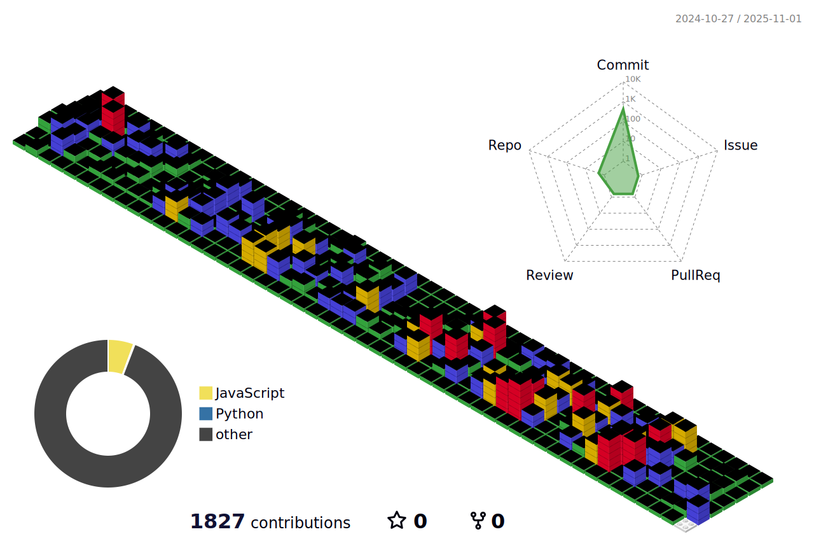

    
    

    
 
    <h2 style="border-bottom: 1px solid #d8dee4; color: #282d33;"> 🎉간단한 소개 </h2>  
    

        <ul style="list-style: none;">
            <li>
                안녕하세요~ 👋 저는 Spring, Spring Boot, React 등을 사용하여 풀스택 웹 개발자로 
            </li>
            <li>
                양산 시설 대관 홈페이지, 양산시 대민 홈페이지 등 개발 및 유지보수를 담당했었고,
            </li>            
            <li>
                 현재는 운동 머신, 앱, 웹 3개의 클라이언트와 연동하는 REST API 서버를 개발하고 있는 1년차 Django 백엔드 개발자입니다!
            </li>
            <li>
                다소 조용하지만 그만큼 소통할 때 다른 사람을 배려하고 존중하려고 노력하며, 책임감을 가지고 일을 하고 있어요!😄
            </li>
            <li>
                개발 시 필요한 정보나 상황은 노션에 정리하여 작업 속도를 올리기 위해 노력하고 있어요~
            </li>
            <li>
                최근에는 많은 양의 운동 데이터를 조회할 때 시간이 오래걸리는 문제를 해결하기 위해 쿼리셋을 최적화하거나 DB 인덱스를 사용하여 시간을 줄이는 이슈를 경험하고 있어요!
            </li>
            <li>
                챗 GPT와 싸우면서 보다 빠르게 개발하지만 왜 사용하는지도 중요하게 생각하며, 어제보다 오늘 더 나은 서비스를 개발하고 싶은 개발자입니다. 잘 부탁드려요🫡
            </li>            
        </ul>   
    

    

        <h2 style="border-bottom: 1px solid #d8dee4; color: #282d33;"> 🛠️ Tech Stacks </h2>   
        
 
          
          
                                            
          
          
                   
          
          
                  
                    
                              
        

    

    

    <h2 style="border-bottom: 1px solid #d8dee4; color: #282d33;"> 🧑‍💻 Contact me </h2>   
    
 
        
        
    
  
    
 
        <h2 style="border-bottom: 1px solid #d8dee4; color: #282d33;"> 🏅 Stats </h2> 
         
         
    
          
        
             

        
  

