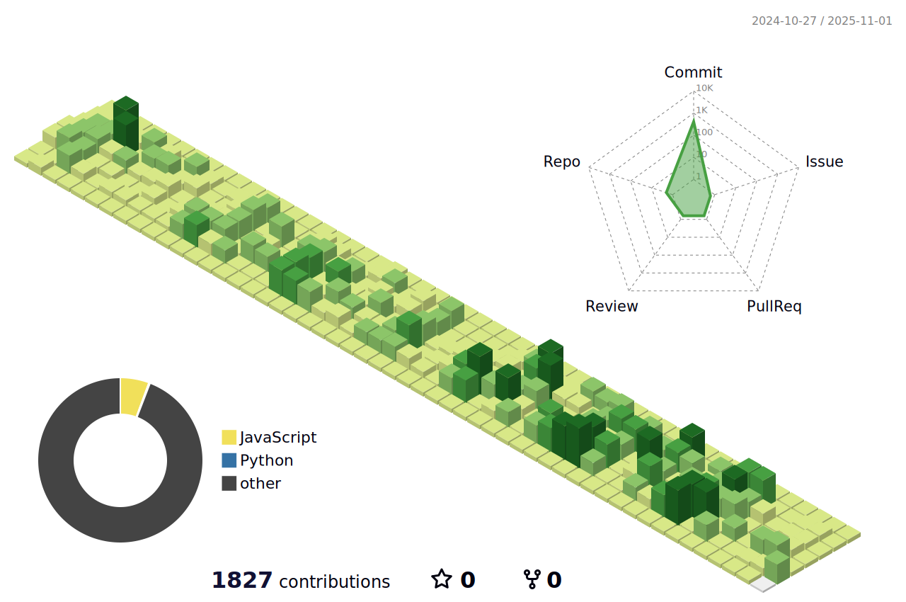

    
    

    
 
    <h2 style="border-bottom: 1px solid #d8dee4; color: #282d33;"> 🎉간단한 소개 </h2>  
    
 안녕하세요~ 👋 저는 현재 풀스택 개발자(3년차) 김도윤이라고 합니다.  </li>고민보단 행동으로 빨리 경험해보자는 생각을 가지고 개발자의 길을 걸어가고 있습니다! 어떤 코드가 나은 코드인지 끊임없이 고민하며 다양한 언어 및 프레임워크를 배우는 것을 좋아합니다. 잘 부탁드려요🙏 
 
    

    

    <h2 style="border-bottom: 1px solid #d8dee4; color: #282d33;"> 🛠️ Tech Stacks </h2>   
    
 
          
          
          
          
           
          
          
          
          
           
          
          
          
          
          
          

    

    

    <h2 style="border-bottom: 1px solid #d8dee4; color: #282d33;"> 🧑‍💻 Contact me </h2>   
    
 
        
        
    
  
    
 
        <h2 style="border-bottom: 1px solid #d8dee4; color: #282d33;"> 🏅 Stats </h2> 
 
         
         
    
 
            

    
